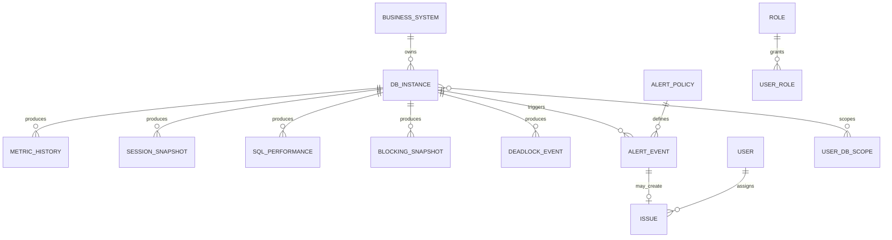

# 데이터 모델 개요 (엔티티 정렬)

Last updated: 2026-05-26 KST

## 1. 문서 목적

PRD §8 주요 엔티티와 [04_db_collection_items.md](./04_db_collection_items.md) §7 공통 정규화 모델을 **단일 스키마 기준**으로 정렬합니다.

- 선행: [T-001_mvp-scope.md](./T-001_mvp-scope.md) (T-001)
- 관련 TASK: [development-plan.md](./development-plan.md) **T-002**
- 후속: T-005(폴더/타입), T-011(메타 API), T-014(Collector), T-019(DDL)

---

## 2. 설계 원칙

| 원칙 | 설명 |
|------|------|
| 공통 식별자 | 모든 시계열·이벤트에 `db_instance_id`, `metric_time`/`collect_time`/`event_time` 포함 |
| DBMS 정규화 | MSSQL/Oracle/Azure raw → 공통 모델 컬럼으로 매핑 (Collector 책임) |
| 운영 vs 시계열 | 메타·설정·이슈는 운영 DB, 고빈도 지표는 시계열 저장소 |
| tenant_id | **1차 MVP: 단일 테넌트** — 컬럼은 nullable 또는 default `1`로 예약, 멀티테넌트는 2차 |

---

## 3. ER 관계 요약



---

## 4. 운영 DB 엔티티 (메타·설정·권한)

### 4.1 BUSINESS_SYSTEM

업무 시스템 마스터. PRD FR-002, 수집 §2.1 `business_system_id` 대응.

| 컬럼 | 타입 | PK/FK | 설명 |
|------|------|-------|------|
| id | uuid | PK | |
| tenant_id | uuid | | 1차 default 단일 |
| code | varchar | UK | 업무 코드 |
| name | varchar | | 업무명 |
| importance | enum | | LOW / MEDIUM / HIGH / CRITICAL |
| owner_dept | varchar | | 담당 부서 |
| created_at | timestamptz | | |
| updated_at | timestamptz | | |

**관계:** `DB_INSTANCE.business_system_id` → FK

**보관:** 영구 (soft delete)

---

### 4.2 DB_INSTANCE

PRD §8.1 `DB_INSTANCE` + 수집 §2.1 확장.

| 컬럼 | 타입 | PK/FK | 설명 | PRD/수집 매핑 |
|------|------|-------|------|----------------|
| id | uuid | PK | | id |
| tenant_id | uuid | | | tenant_id |
| dbms_type | enum | | MSSQL, ORACLE, AZURE_SQL | dbms_type |
| instance_name | varchar | | 표시명 | |
| host | varchar | | | host |
| port | int | | | port |
| service_name | varchar | | DB/서비스명 | service_name |
| database_name | varchar | | | |
| business_system_id | uuid | FK | | business_system_id |
| importance | enum | | | importance |
| env_type | enum | | PROD, DEV, STG, DR | 운영 구분 |
| collector_type | enum | | AGENT, AGENTLESS, API | collector_type |
| collector_id | varchar | | 할당 Collector | collector_id |
| collect_interval_sec | int | | 5~60 | 수집 §1.3 |
| sql_aggregate_interval_sec | int | | 60~300 | |
| is_active | boolean | | 수집 활성화 | |
| connection_secret_ref | varchar | | 암호화 저장 키 참조 | NFR-004 |
| last_collect_at | timestamptz | | | 최종 수집 |
| last_collect_status | enum | | OK, FAIL, DELAYED | 수집 §2.2 |
| created_at | timestamptz | | | |
| updated_at | timestamptz | | | |

**관계**

- N:1 `BUSINESS_SYSTEM`
- 1:N `METRIC_HISTORY`, `SESSION_SNAPSHOT`, `SQL_PERFORMANCE`, `ALERT_EVENT`

**보관:** 영구

---

### 4.3 USER / ROLE / USER_ROLE

FR-016, 권한 §5.

| 엔티티 | PK | 주요 컬럼 |
|--------|-----|-----------|
| USER | id (uuid) | sso_subject, email, name, is_active, last_login_at |
| ROLE | id (uuid) | code (SYS_ADMIN, DBA, OPS, DEV, SECURITY, VIEWER), name |
| USER_ROLE | (user_id, role_id) | granted_at, granted_by |
| MENU_PERMISSION | id | role_id, menu_code, can_read, can_write |
| USER_DB_SCOPE | (user_id, db_instance_id) | scope_type (READ, ADMIN) |

**보관:** 영구, 변경 시 `AUDIT_LOG`

---

### 4.4 ALERT_POLICY

FR-013, 수집 §6 알림 기준.

| 컬럼 | 타입 | 설명 |
|------|------|------|
| id | uuid | PK |
| name | varchar | 정책명 |
| db_instance_id | uuid | FK, null=템플릿 |
| event_type | enum | CPU_HIGH, BLOCKING_LONG, DEADLOCK, ... |
| metric_name | varchar | 대상 지표 |
| threshold | numeric | 임계치 |
| duration_sec | int | 지속 시간 조건 |
| severity | enum | INFO, WARN, CRITICAL |
| suppress_minutes | int | 중복 억제 |
| renotify_minutes | int | 재알림 |
| channel | enum | EMAIL, TEAMS, SLACK |
| is_active | boolean | |

**관계:** 1:N `ALERT_EVENT`

**보관:** 영구

---

### 4.5 ALERT_EVENT

PRD §8.1 `ALERT_EVENT` + 정규화.

| 컬럼 | 타입 | PK/FK | 설명 | PRD 매핑 |
|------|------|-------|------|----------|
| id | uuid | PK | | |
| tenant_id | uuid | | | |
| db_instance_id | uuid | FK | | |
| alert_policy_id | uuid | FK | | |
| alert_type | varchar | | | alert_type |
| severity | enum | | | severity |
| current_value | numeric | | | current_value |
| threshold | numeric | | | threshold |
| status | enum | | NEW, ACK, CLOSED | status |
| message | text | | 한글 요약 | |
| related_sql_id | varchar | | | |
| related_session_id | varchar | | | |
| occurred_at | timestamptz | | | |
| acknowledged_at | timestamptz | | | |
| acknowledged_by | uuid | FK→USER | | |

**보관:** 1년 이상 (PRD §11, 수집 §8.3)

---

### 4.6 ISSUE

PRD §8.1 `ISSUE` 확장. **2차** 본격 구현, 1차는 목록·카운트만.

| 컬럼 | 타입 | PK/FK | 설명 | PRD 매핑 |
|------|------|-------|------|----------|
| id | uuid | PK | | |
| issue_no | varchar | UK | | issue_no |
| title | varchar | | | title |
| issue_type | enum | | PERF, LOCK, SECURITY | |
| status | enum | | NEW, ACK, IN_PROGRESS, DONE, HOLD | status |
| assignee_id | uuid | FK→USER | | assignee |
| db_instance_id | uuid | FK | | |
| alert_event_id | uuid | FK | | |
| created_at | timestamptz | | | created_at |
| updated_at | timestamptz | | | |

**관계:** N:1 `ALERT_EVENT` (optional), 1:N `ISSUE_ACTION` (2차)

**보관:** 1년 이상

---

### 4.7 AUDIT_LOG

NFR-004 감사 로그.

| 컬럼 | 타입 | 설명 |
|------|------|------|
| id | uuid | PK |
| user_id | uuid | |
| action | varchar | LOGIN, DB_REGISTER, POLICY_CHANGE, ... |
| target_type | varchar | |
| target_id | varchar | |
| detail_json | jsonb | 민감정보 제외 |
| created_at | timestamptz | |

**보관:** 1년 이상 (감사 정책)

---

## 5. 시계열·분석 엔티티

### 5.1 METRIC_HISTORY

PRD §8.1 ↔ 수집 §7.2 성능 지표 공통 모델.

| PRD 컬럼 | 정규화 컬럼 | 타입 | 비고 |
|----------|-------------|------|------|
| id | id | bigint/uuid | PK, 시계열은 (time, db_instance_id, metric_name) 복합 UK 가능 |
| db_instance_id | db_instance_id | uuid | FK |
| metric_name | metric_name | varchar | cpu_pct, mem_pct, io_read_iops, ... |
| metric_value | metric_value | numeric | |
| metric_time | metric_time | timestamptz | |
| — | metric_category | varchar | RESOURCE, SESSION, TXN |
| — | metric_unit | varchar | %, ms, count |
| — | severity | enum | 정상/주의/경고 산출 시 |
| — | raw_source | varchar | DMV 이름 등 |
| — | tenant_id | uuid | |

**인덱스:** `(db_instance_id, metric_name, metric_time DESC)`

**보관**

| 집계 단계 | 보관 | 근거 |
|-----------|------|------|
| 초 단위 원천 | 7~30일 | PRD §11, 수집 §8.1 |
| 1분 집계 | 3개월 | 수집 §8.2 |
| 1시간 집계 | 1년+ | 수집 §8.2 |

---

### 5.2 SESSION_SNAPSHOT

PRD §8.1 ↔ 수집 §7.4.

| PRD 컬럼 | 정규화 컬럼 | 타입 |
|----------|-------------|------|
| session_id | session_id | varchar/int |
| status | status | varchar |
| wait_name | wait_name | varchar |
| blocking_session_id | blocking_session_id | varchar/int |
| elapsed_ms | elapsed_ms | bigint |
| — | collect_time | timestamptz |
| — | db_instance_id | uuid |
| — | user_name | varchar |
| — | host_name | varchar |
| — | program_name | varchar |
| — | sql_id | varchar |
| — | cpu_ms | bigint |
| — | logical_reads | bigint |

**PK:** `(collect_time, db_instance_id, session_id)` 또는 surrogate `id`

**보관:** 7~30일 (수집 §8.1)

---

### 5.3 SQL_PERFORMANCE

PRD §8.1 ↔ 수집 §7.3.

| PRD 컬럼 | 정규화 컬럼 | 타입 |
|----------|-------------|------|
| sql_id | sql_id | varchar |
| query_hash | sql_hash | varchar |
| avg_elapsed_ms | avg_elapsed_ms | numeric |
| cpu_ms | cpu_ms | numeric |
| logical_reads | logical_reads | bigint |
| plan_id | plan_id | varchar |
| — | collect_time | timestamptz |
| — | db_instance_id | uuid |
| — | normalized_sql | text | 마스킹 적용 |
| — | executions | int |
| — | max_elapsed_ms | numeric |
| — | physical_reads | bigint |
| — | writes | bigint |
| — | wait_ms | bigint |
| — | baseline_elapsed_ms | numeric | 2차 |
| — | regression_rate | numeric | 2차 |

**PK:** `(collect_time, db_instance_id, sql_id, plan_id)` 또는 interval 집계 키

**보관:** 6개월~1년 (PRD §11, 수집 §8.3)

---

### 5.4 BLOCKING_SNAPSHOT (1차 추가)

PRD에 명시 엔티티 없음 — FR-005, 수집 §2.9.

| 컬럼 | 타입 |
|------|------|
| id | uuid/bigint |
| collect_time | timestamptz |
| db_instance_id | uuid |
| blocker_session_id | varchar |
| blocked_session_id | varchar |
| lock_type | varchar |
| wait_ms | bigint |
| object_name | varchar |
| sql_id | varchar |

**보관:** 30일 (수집 §8.1)

---

### 5.5 DEADLOCK_EVENT (1차 추가)

수집 §2.10.

| 컬럼 | 타입 |
|------|------|
| id | uuid |
| occurred_at | timestamptz |
| db_instance_id | uuid |
| victim_session_id | varchar |
| related_sessions | jsonb |
| related_sql_ids | jsonb |
| graph_xml | text | |
| recurrence_key | varchar | 반복 패턴 |

**보관:** 1년 이상

---

### 5.6 SECURITY_EVENT (3차)

수집 §7.5 — MVP 스키마만 예약.

| 정규화 컬럼 | PRD/수집 |
|-------------|----------|
| event_time | event_time |
| db_instance_id | db_instance_id |
| event_type | event_type |
| account_name | account_name |
| source_ip | source_ip |
| risk_level | risk_level |

**보관:** 감사 정책 1년+

---

## 6. PRD ↔ 정규화 모델 매핑표

| PRD 엔티티 | 정규화 모델 | 저장소 | 1차 MVP |
|------------|-------------|--------|---------|
| DB_INSTANCE | §4.2 + §2.1 식별자 | 운영 DB | ○ |
| METRIC_HISTORY | §5.1 + §7.2 | 시계열 | ○ |
| SQL_PERFORMANCE | §5.3 + §7.3 | 시계열/분석 | ○ |
| SESSION_SNAPSHOT | §5.2 + §7.4 | 시계열 | ○ |
| ALERT_EVENT | §4.5 | 운영 DB | ○ |
| ISSUE | §4.6 | 운영 DB | △ 목록만 |
| (없음) | BLOCKING_SNAPSHOT | 시계열 | ○ |
| (없음) | DEADLOCK_EVENT | 시계열/이벤트 | ○ |
| (없음) | BUSINESS_SYSTEM, USER, ROLE | 운영 DB | ○ |

---

## 7. 엔티티별 보관 정책 요약

| 엔티티 | 1차 보관 | 집계 | 근거 문서 |
|--------|----------|------|-----------|
| METRIC_HISTORY (raw) | 30일 | 1m/1h | PRD §11, 수집 §8 |
| SESSION_SNAPSHOT | 30일 | — | 수집 §8.1 |
| BLOCKING_SNAPSHOT | 30일 | — | 수집 §8.1 |
| DEADLOCK_EVENT | 365일+ | — | 수집 §8.1 |
| SQL_PERFORMANCE | 180일+ | 5m | PRD §11 |
| ALERT_EVENT | 365일+ | — | PRD §11 |
| ISSUE | 365일+ | — | PRD §11 |
| AUDIT_LOG | 365일+ | — | NFR-004 |

---

## 8. 타입·코드 값 (공통 enum)

```text
dbms_type: MSSQL | ORACLE | AZURE_SQL
importance / severity: INFO | WARN | CRITICAL (및 LOW | MEDIUM | HIGH)
collector_type: AGENT | AGENTLESS | API
alert_status: NEW | ACK | CLOSED
issue_status: NEW | ACK | IN_PROGRESS | DONE | HOLD
db_health: NORMAL | CAUTION | WARNING | OUTAGE
```

---

## 9. 결정 사항 (T-002)

| 항목 | 결정 | 비고 |
|------|------|------|
| tenant_id | 1차 단일 테넌트, 컬럼 예약 | 멀티테넌트 2차 |
| METRIC_HISTORY PK | 시계열 DB에서 time+instance+name 복합 | Timescale hypertable 권장 |
| ISSUE | 1차 스키마만, 워크플로 2차 | T-001 MVP 범위 반영 |
| BLOCKING/DEADLOCK | 별도 테이블 | PRD 보완 |
| connection_secret | 평문 저장 금지, secret_ref + KMS/Supabase Vault | T-012 |

---

## 10. 변경 이력

| 일자 | 변경 | TASK |
|------|------|------|
| 2026-05-26 | 최초 작성 — PRD §8 + 수집 §7 정렬 | T-002 |
