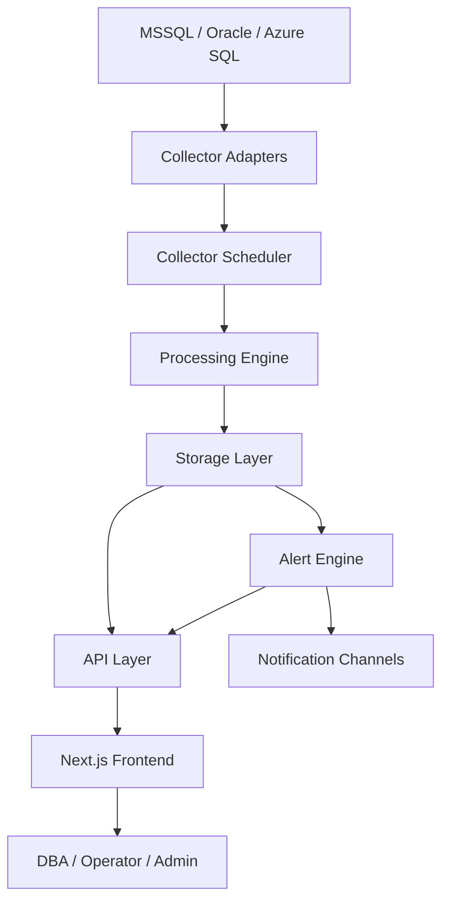
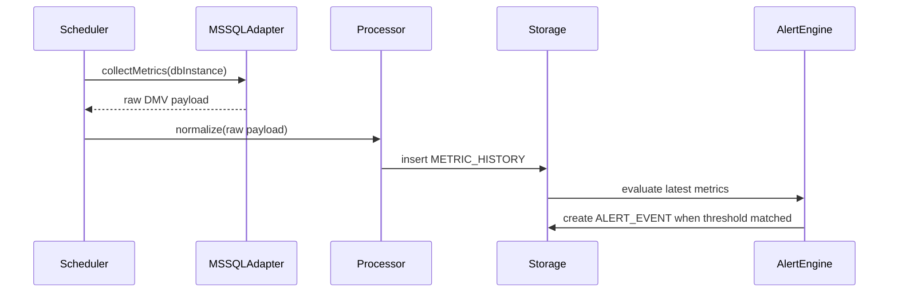
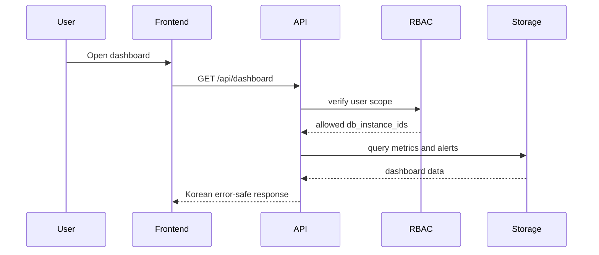

# 시스템 아키텍처 및 서브시스템 경계

Last updated: 2026-05-26 KST

## 1. 문서 목적

본 문서는 [PRD.md](./PRD.md) §6 시스템 아키텍처를 기준으로 통합 DB 모니터링 시스템의 **서브시스템 책임**, **입출력**, **배포 단위**, **통신 방식**, **1차 MVP 구현 경계**를 정의합니다.

- 선행: [T-001_mvp-scope.md](./T-001_mvp-scope.md)
- 참고: [T-002_data-model-outline.md](./T-002_data-model-outline.md)
- 관련 TASK: [development-plan.md](./development-plan.md) **T-003**
- 후속: T-004(보안 체크리스트), T-005(폴더 구조), T-010(RBAC)

---

## 2. 1차 MVP 아키텍처 결정

| 항목 | 결정 | 이유 |
|------|------|------|
| 저장소 구조 | 현재 Next.js 앱 중심으로 시작, Collector/Worker는 같은 repo 내 모듈로 분리 | 초기 속도와 AGENT 인수인계 단순화 |
| API | Next.js Route Handlers 우선 | 현재 repo가 Next.js 16 App Router 기반이며 MVP API 범위가 명확함 |
| Collector | 별도 Worker 프로세스로 실행 가능한 모듈 구조 | Next.js 앱과 같은 repo에서 독립 실행 가능하게 분리 |
| 실시간 갱신 | 1차는 polling 또는 SSE, WebSocket은 후속 확장 가능 | Next.js 환경에서 구현 난도와 운영 부담 절충 |
| Queue | 1차는 in-process scheduler, 부하 증가 시 Redis/BullMQ | PRD의 Redis/BullMQ는 확장 단계로 반영 |
| 운영 DB | Supabase(PostgreSQL) 우선 | 프로젝트 규칙 및 Auth/DB 연계 |
| 시계열 | PostgreSQL 파티션으로 시작, TimescaleDB 호환 구조 유지 | 인프라 확정 전 MVP 구현 가능 |
| DBMS 수집 | MSSQL Agentless 완전 구현, Azure SQL DMV 기반 구현, Oracle은 어댑터 인터페이스만 | T-001 MVP 범위 |

> 백엔드 프레임워크는 Next.js로 통합하고, API는 Route Handlers 중심으로 구현합니다. 장시간 수집 작업은 Next.js 요청 생명주기와 분리될 수 있도록 Worker 모듈로 독립 실행 가능하게 둡니다.

---

## 3. 전체 구조



---

## 4. 서브시스템 책임

### 4.1 Frontend

| 항목 | 내용 |
|------|------|
| 책임 | 대시보드, 실시간 모니터링, DB 관리, 사용자/권한, 알림 화면 제공 |
| 주요 입력 | API 응답, SSE/polling 데이터 |
| 주요 출력 | 사용자 액션, 필터, 확인 처리, 관리 설정 |
| 1차 화면 | 통합 현황, DB 실시간, 세션, Blocking, Deadlock, Wait, Top SQL, 실시간 알림, DB 인스턴스 관리, 사용자/권한 |
| 기술 | Next.js 16 App Router, TypeScript, Tailwind, shadcn/ui, Recharts |

**필수 UI 상태:** 로딩, 빈 상태, 오류 상태, 권한 없음 상태.

---

### 4.2 API Layer

| 항목 | 내용 |
|------|------|
| 책임 | Frontend용 REST API, 권한 검증, 입력 검증, 공통 오류 응답 |
| 주요 입력 | 인증 세션, 쿼리 파라미터, 관리 요청 |
| 주요 출력 | `{ data, error, meta }` 형태 응답 |
| 1차 API | DB 인스턴스, 업무 시스템, 지표 조회, 세션 조회, Top SQL, 알림, 사용자/권한 |
| 기술 | Next.js Route Handlers 우선 |

**경계:** API는 DB 접속 문자열이나 민감한 raw 오류를 Frontend로 전달하지 않습니다.

---

### 4.3 Collector Scheduler

| 항목 | 내용 |
|------|------|
| 책임 | DB 인스턴스별 수집 주기 실행, 재시도, 수집 상태 기록 |
| 주요 입력 | `DB_INSTANCE`, 수집 설정, 활성화 여부 |
| 주요 출력 | raw collection payload, 수집 성공/실패 상태 |
| 1차 범위 | MSSQL 5~60초 지표, 1~5분 SQL 집계 |
| 기술 | Node.js worker 모듈, 추후 BullMQ 대체 가능 |

**경계:** Scheduler는 데이터를 해석하지 않고 수집 실행과 상태 관리에 집중합니다.

---

### 4.4 Collector Adapters

| 어댑터 | 1차 상태 | 책임 |
|--------|----------|------|
| MSSQL | 구현 | DMV, Query Store, Deadlock XML 수집 |
| Oracle | 스텁 | 인터페이스만 유지, ASH/AWR 라이선스 검토 후 구현 |
| Azure SQL | DMV 기반 구현 | MSSQL 호환 DMV + Azure SQL resource stats 수집, Azure Monitor/API는 후속 확장 |

**공통 인터페이스 후보**

```ts
type CollectorAdapter = {
  testConnection: () => Promise<ConnectionTestResult>;
  collectAvailability: () => Promise<AvailabilityPayload>;
  collectMetrics: () => Promise<MetricPayload[]>;
  collectSessions: () => Promise<SessionPayload[]>;
  collectLocks: () => Promise<BlockingPayload[]>;
  collectDeadlocks: () => Promise<DeadlockPayload[]>;
  collectTopSql: () => Promise<SqlPerformancePayload[]>;
};
```

---

### 4.5 Processing Engine

| 항목 | 내용 |
|------|------|
| 책임 | DBMS별 raw payload를 공통 모델로 정규화 |
| 주요 입력 | Collector raw payload |
| 주요 출력 | `METRIC_HISTORY`, `SESSION_SNAPSHOT`, `SQL_PERFORMANCE`, `BLOCKING_SNAPSHOT`, `DEADLOCK_EVENT` |
| 핵심 규칙 | `tenant_id`, `db_instance_id`, `dbms_type`, `metric_time` 포함 |
| 보안 | SQL Text literal 제거 또는 마스킹 |

**경계:** Processing은 알림 판단을 하지 않고, 정규화와 마스킹만 담당합니다.

---

### 4.6 Storage Layer

| 저장 영역 | 엔티티 | 보관 |
|-----------|--------|------|
| 운영 DB | `DB_INSTANCE`, `BUSINESS_SYSTEM`, `USER`, `ROLE`, `ALERT_POLICY`, `ALERT_EVENT`, `ISSUE`, `AUDIT_LOG` | 영구 또는 1년+ |
| 시계열 | `METRIC_HISTORY`, `SESSION_SNAPSHOT`, `BLOCKING_SNAPSHOT` | 7~30일 raw + 집계 |
| 분석 | `SQL_PERFORMANCE`, `DEADLOCK_EVENT` | 6개월~1년+ |

**경계:** 운영 데이터와 고빈도 지표는 물리적으로 분리 가능한 구조로 설계합니다.

---

### 4.7 Alert Engine

| 항목 | 내용 |
|------|------|
| 책임 | 임계치 평가, 이벤트 생성, 중복 억제, 재알림 판단 |
| 주요 입력 | `METRIC_HISTORY`, `SESSION_SNAPSHOT`, `SQL_PERFORMANCE`, `ALERT_POLICY` |
| 주요 출력 | `ALERT_EVENT`, notification request |
| 1차 이벤트 | CPU_HIGH, MEMORY_HIGH, LOG_USAGE_HIGH, BLOCKING_LONG, DEADLOCK, LONG_QUERY, COLLECT_FAILED |

**경계:** Alert Engine은 알림 발송 채널의 세부 구현을 알지 않고 Notification Adapter를 호출합니다.

---

### 4.8 Notification Adapter

| 채널 | 1차 여부 | 비고 |
|------|----------|------|
| Email | 후보 | SMTP/사내 메일 |
| Teams | 후보 | Webhook 간단 연동 |
| Slack | 후순위 | 필요 시 추가 |
| SMS/알림톡 | 후순위 | 외부 계약/비용 검토 |

**1차 원칙:** Email 또는 Teams 중 1개를 먼저 구현합니다.

---

### 4.9 Auth/RBAC/Audit

| 항목 | 내용 |
|------|------|
| 인증 | 사내 SSO + JWT/세션 |
| 권한 | 역할, 메뉴, 기능, DB 그룹 범위 |
| 감사 | 로그인, DB 등록/수정, 알림 정책 변경, 권한 변경, 세션 종료 요청 |
| 1차 역할 | 시스템 관리자, DBA 관리자, 업무 운영자, 개발자, 보안 담당자, 조회 사용자 |

**경계:** 권한은 Frontend 숨김이 아니라 API 서버 측에서 반드시 검증합니다.

---

## 5. 주요 데이터 흐름

### 5.1 실시간 지표 수집 흐름



### 5.2 화면 조회 흐름



---

## 6. 1차 API 경계

| 영역 | Endpoint 후보 | 설명 |
|------|----------------|------|
| Health | `GET /api/health` | 앱/API 상태 |
| Auth | `GET /api/auth/session` | 세션 정보 |
| DB 관리 | `GET/POST /api/db-instances` | 인스턴스 목록/등록 |
| 연결 테스트 | `POST /api/db-instances/{id}/test-connection` | 접속 확인 |
| 지표 | `GET /api/metrics/realtime` | DB별 최신 지표 |
| 세션 | `GET /api/sessions` | 실시간 세션 |
| Blocking | `GET /api/blocking` | Blocking tree |
| Deadlock | `GET /api/deadlocks` | Deadlock 이력 |
| SQL | `GET /api/sql/top` | Top SQL |
| 알림 | `GET/PATCH /api/alerts` | 알림 목록/확인 |
| 권한 | `GET/POST /api/users`, `GET/POST /api/roles` | 사용자/역할 |

---

## 7. 배포 단위

| 단계 | Web | Worker | Storage | Queue |
|------|-----|--------|---------|-------|
| MVP | Next.js 단일 앱 | 같은 repo의 worker script | Supabase/PostgreSQL | 없음 또는 in-process |
| 확장 | Next.js 앱 | 독립 Collector 서비스 | TimescaleDB 분리 | Redis/BullMQ |
| 운영 고도화 | Kubernetes | 수평 확장 Collector | HA 구성 | 메시지 큐 필수 |

---

## 8. 운영 관측성

| 대상 | 지표 |
|------|------|
| Collector | 마지막 수집 시각, 성공/실패, 연속 실패 수, 지연 시간 |
| API | 응답 시간, 오류율, 권한 거부 수 |
| Alert | 이벤트 생성 수, 중복 억제 수, 발송 실패 수 |
| Storage | 적재 지연, 보관 정책 job 결과 |

---

## 9. T-003 결정 사항

| 항목 | 결정 |
|------|------|
| 1차 구현 구조 | Next.js API + 분리 가능한 Worker 모듈 |
| Backend Framework | Next.js 16 App Router로 통합 |
| Queue | MVP에서는 선택, Collector 부하 증가 시 Redis/BullMQ 도입 |
| 실시간 | polling/SSE 우선, WebSocket은 필요 시 확장 |
| DBMS | MSSQL 구현, Azure SQL DMV 기반 구현, Oracle은 인터페이스 |

---

## 10. 변경 이력

| 일자 | 변경 | TASK |
|------|------|------|
| 2026-05-26 | 최초 작성 — 서브시스템 경계 및 1차 MVP 아키텍처 결정 | T-003 |
