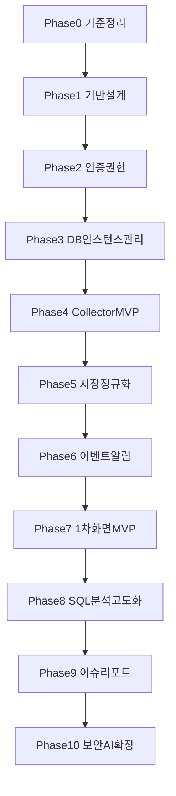

# 통합 DB 모니터링 시스템 개발 계획

Last updated: 2026-05-26 KST (T-011~T-013 완료, Phase 2 보류)

## 1. 문서 목적

본 문서는 [PRD.md](./PRD.md)와 보조 설계 문서를 기준으로 **실행 순서**, **선후행 의존성**, **진행 상태**, **작업 내역**, **이슈**를 관리하기 위한 개발 계획서입니다.

- 다른 PC에서 작업을 이어갈 때: `git pull` 후 본 문서와 [session-handoff.md](./session-handoff.md)를 함께 확인합니다.
- AGENT에 작업을 위임할 때: 본 문서의 **현재 진행 TASK**와 **상태**를 먼저 갱신한 뒤 위임합니다.
- 세션 인수인계 요약: [session-handoff.md](./session-handoff.md)
- 상세 요구사항: [02_requirements_definition.md](./02_requirements_definition.md)
- 화면 구성: [03_screen_design_outline.md](./03_screen_design_outline.md)
- 수집 항목: [04_db_collection_items.md](./04_db_collection_items.md)

---

## 2. 프로젝트 목표

| 구분 | 내용 |
|------|------|
| 프로젝트명 | 통합 DB 모니터링 및 성능 분석 시스템 |
| 목적 | MSSQL, Oracle, Azure SQL Database 등 이기종 DB 환경의 통합 모니터링, 장애 예방, 성능 분석, 보안 점검, 이슈 대응 표준화 |
| 1차 구축(MVP) | 실시간 모니터링, 세션/Blocking/Deadlock/Wait, Top SQL, 기본 알림, DB 인스턴스 관리, 사용자/권한 관리 |
| 2차 구축 | 실행 계획 분석, 이슈 관리, 리포트, 성능 회귀 탐지 |
| 3차 구축 | 보안 분석, AI 이상 탐지, 자동 개선 권고, 용량 예측 |

### 2.1 현재 저장소 상태 (기준일: 2026-05-26)

| 항목 | 상태 |
|------|------|
| Framework | Next.js 16.2.6, React 19.2.4 |
| Styling | Tailwind CSS 4 |
| UI Component | Shadcn/ui 설치됨 |
| Lint | ESLint 9 + eslint-config-next 16.2.6 |
| Chart | Recharts 설치됨 |
| 앱 코드 | T-005 폴더·타입·API health·포털 Route Group 스켈레톤 |
| 백엔드/수집/DB | `services/collector` 스텁, DB 클라이언트 미연동 |
| 문서 | PRD, 요구사항, 화면, 수집 항목 정의 완료 |

### 2.2 기술 스택 결정 (PRD + 프로젝트 규칙)

| 영역 | 기술 | 비고 |
|------|------|------|
| Frontend | Next.js 16 App Router, TypeScript | 현재 저장소 기준 |
| Styling | Tailwind CSS | 기존 스타일링 기준 유지 |
| UI Component | Shadcn/ui | `components/ui` 패턴 우선 |
| Lint | ESLint (Next/TS 규칙 기반) | `npm run lint` 기준 |
| 상태 관리 | React Query(또는 TanStack Query), Zustand | PRD 권장 |
| 차트 | Recharts (설치됨) 또는 ECharts | PRD 선택 |
| 운영 DB | Supabase(PostgreSQL) 또는 PostgreSQL | 프로젝트 규칙 기준 Supabase 우선 검토 |
| 시계열 | TimescaleDB | PRD 권장, Phase 5에서 확정 |
| 인증 | SSO + JWT | NFR-004 |
| 수집 | Agent / Agentless / API | 1차 MSSQL Agentless 우선 |
| 백엔드 API | Next.js Route Handlers + 별도 Worker | Next.js 풀스택 기준 |

---

## 3. 작업 상태 관리 규칙

### 3.1 상태 값

| 상태 | 의미 |
|------|------|
| `대기` | 선행 작업 미완료 또는 착수 전 |
| `진행중` | 현재 AGENT/개발자가 작업 중 |
| `검토필요` | 구현 완료, 검증 또는 의사결정 대기 |
| `완료` | 완료 기준 충족, 후행 작업 착수 가능 |
| `보류` | blocker 또는 외부 의존으로 일시 중단 |

### 3.2 TASK 문서 필드

각 TASK는 아래 필드를 유지합니다.

- **실행 순서**: 전체 개발 흐름상 순번
- **선행 작업**: 시작 전 완료되어야 할 TASK ID
- **후행 작업**: 본 TASK 완료 후 가능한 TASK ID
- **진행 상태** / **완료 여부**
- **작업 내역**: 날짜, 수행자(AGENT), 변경 요약
- **이슈/결정사항**: blocker, 기술 결정, 미해결 항목

### 3.3 산출물 네이밍 규칙

TASK별 독립 문서 산출물은 추적과 인수인계를 위해 아래 규칙을 따릅니다.

- 기본 형식: `docs/T-XXX_파일명.md`
- `T-XXX`는 development-plan의 TASK ID와 반드시 일치시킵니다. 예: `T-005_folder-structure.md`
- 파일명은 영문 소문자 kebab-case 또는 snake_case를 사용합니다. 기존 문서와의 가독성을 위해 TASK 산출물은 snake_case를 기본으로 합니다.
- 하나의 TASK에서 산출물 문서가 여러 개인 경우 목적을 분리해 작성합니다. 예: `T-007_api-response-contract.md`, `T-007_error-handling.md`
- TASK 표의 **산출물** 필드와 작업 내역에는 실제 파일명을 링크로 기록합니다.
- 코드·컴포넌트·API 파일은 본 규칙 대신 각 영역의 네이밍 규칙(PascalCase 컴포넌트, route.ts 등)을 따릅니다.
- 기존 `T-001`~`T-005` 산출물은 이 규칙을 기준으로 유지합니다.

### 3.4 AGENT 작업 원칙

1. 작업 시작 전 `docs/PRD.md`, 본 문서, `.cursor/rules/project-rules.mdc`를 확인합니다.
2. 담당 TASK의 **선행 작업**이 `완료`인지 확인합니다.
3. 착수 시 해당 TASK 상태를 `진행중`으로 변경하고 **작업 내역**에 시작 시각을 기록합니다.
4. 완료 시 **완료 기준**을 점검하고 상태를 `완료` 또는 `검토필요`로 변경합니다.
5. 세션 종료 전 [session-handoff.md](./session-handoff.md)의 현재 목표·다음 단계를 갱신합니다.
6. Next.js 코드 수정 시 `node_modules/next/dist/docs/` 및 `AGENTS.md`를 따릅니다.

### 3.5 AGENT 시작 프롬프트 (복사용)

```text
docs/development-plan.md와 docs/PRD.md를 기준으로 현재 진행 중인 TASK를 이어서 진행해줘.
먼저 git status를 확인하고, development-plan.md의 진행 상태와 실제 repo 상태가 다른 부분이 있으면 알려줘.
선행 작업 완료 여부를 확인한 뒤, 담당 TASK의 상세 작업과 완료 기준에 맞춰 구현해줘.
작업 완료 후 development-plan.md의 작업 내역, 이슈, 진행 상태를 갱신해줘.
```

---

## 4. 전체 개발 흐름



### 4.1 Phase 요약

| Phase | 명칭 | PRD 구축 단계 | 핵심 산출물 |
|-------|------|---------------|-------------|
| 0 | 기준 정리 | 사전 | MVP 범위 확정, 용어/엔티티 정렬 |
| 1 | 기반 설계 | 사전 | 폴더 구조, 공통 UI, API 스켈레톤 |
| 2 | 인증·권한 | 1차 | SSO, RBAC, 감사 로그 기반 |
| 3 | DB 인스턴스 관리 | 1차 | 등록/연결테스트/수집설정 API·UI |
| 4 | Collector MVP | 1차 | MSSQL Agentless 수집 |
| 5 | 저장·정규화 | 1차 | 스키마, 시계열, 공통 모델 |
| 6 | 이벤트·알림 | 1차 | 임계치, 알림 이벤트, 중복 억제 |
| 7 | 1차 화면 MVP | 1차 | 대시보드, 실시간 모니터링 화면 |
| 8 | SQL 분석 고도화 | 2차 | Plan 변경, SQL 상세, 회귀 탐지 |
| 9 | 이슈·리포트 | 2차 | 이슈 관리, PDF/Excel 리포트 |
| 10 | 보안·AI 확장 | 3차 | 계정/보안, AI 요약·권고 |

### 4.2 현재 진행 TASK

| 항목 | 값 |
|------|-----|
| **다음 착수 권장 TASK** | T-041 |
| **현재 Phase** | Phase 8 SQL 분석 고도화 완료 / Phase 2·메신저·RLS 보류 |
| **전체 진행률** | 36 / 45 TASK 완료 |

> AGENT는 작업 착수 시 위 표를 갱신합니다.

---

## 5. Phase 0 — 기준 정리

### T-001: MVP 범위 및 1차 구축 범위 확정

| 필드 | 내용 |
|------|------|
| 실행 순서 | 1 |
| 선행 작업 | 없음 |
| 후행 작업 | T-002, T-003, T-004 |
| Phase | 0 |
| PRD 매핑 | §13 1차 구축, FR-001~FR-007, FR-013, FR-016 |
| 목표 | 1차 MVP 기능·화면·수집 항목을 단일 기준으로 확정 |
| 상세 작업 | PRD §13, 요구사항 §8 우선순위, 화면 §6 우선 구축 화면, 수집 §11 1차 우선 항목을 교차 대조하여 MVP 체크리스트 작성 |
| 완료 기준 | MVP 기능 목록, 제외 범위(2·3차), 화면 목록, 수집 DBMS(MSSQL 우선) 문서화 |
| 산출물 | [T-001_mvp-scope.md](./T-001_mvp-scope.md) |
| 진행 상태 | `완료` |
| 완료 여부 | ☑ |
| 작업 내역 | 2026-05-26 AGENT: PRD·요구사항·화면·수집 문서 교차 대조 후 `docs/T-001_mvp-scope.md` 작성. 1차 FR 9건, 화면 10종, MSSQL 수집 우선, 2·3차 제외 목록 확정. |
| 이슈/결정사항 | Oracle/Azure는 1차에서 수집 인터페이스만 열고 구현은 후순위. TimescaleDB는 1차 PostgreSQL 파티션으로 시작 가능. |

---

### T-002: 도메인 용어 및 엔티티 정렬

| 필드 | 내용 |
|------|------|
| 실행 순서 | 2 |
| 선행 작업 | T-001 |
| 후행 작업 | T-005, T-011, T-014 |
| Phase | 0 |
| PRD 매핑 | §8 데이터 모델 |
| 목표 | PRD 엔티티와 수집 정규화 모델을 일치시킴 |
| 상세 작업 | DB_INSTANCE, METRIC_HISTORY, SQL_PERFORMANCE, SESSION_SNAPSHOT, ALERT_EVENT, ISSUE와 §7.1~7.5 공통 모델 매핑표 작성 |
| 완료 기준 | 엔티티별 필드, PK, 관계, 보관 정책 연결 완료 |
| 산출물 | [T-002_data-model-outline.md](./T-002_data-model-outline.md) |
| 진행 상태 | `완료` |
| 완료 여부 | ☑ |
| 작업 내역 | 2026-05-26 AGENT: PRD §8 6엔티티 + 수집 §7.1~7.5 매핑, 운영/시계열 분리, ER 요약, BLOCKING/DEADLOCK/AUDIT 보완, 보관 정책·enum 정의. |
| 이슈/결정사항 | tenant_id: 1차 단일 테넌트(컬럼 예약). ISSUE 워크플로는 2차. |

---

### T-003: 아키텍처 및 서브시스템 경계 정의

| 필드 | 내용 |
|------|------|
| 실행 순서 | 3 |
| 선행 작업 | T-001 |
| 후행 작업 | T-004, T-005, T-010 |
| Phase | 0 |
| PRD 매핑 | §6 시스템 아키텍처 |
| 목표 | Collector, Processing, Alert, Analysis, API, Frontend, Storage 경계 확정 |
| 상세 작업 | PRD §6.1 흐름도 기준 컴포넌트 책임, 배포 단위, 통신 방식(REST/WebSocket/Queue) 정의 |
| 완료 기준 | 아키텍처 다이어그램, 컴포넌트별 입출력, 1차 구현 범위(모노레포 vs 분리) 결정 |
| 산출물 | [T-003_architecture.md](./T-003_architecture.md) |
| 진행 상태 | `완료` |
| 완료 여부 | ☑ |
| 작업 내역 | 2026-05-26 AGENT: PRD §6 기준으로 Frontend, API, Collector, Processing, Storage, Alert, Notification, Auth/RBAC/Audit 경계와 데이터 흐름, 1차 API, 배포 단위 작성. |
| 이슈/결정사항 | Backend Framework는 Next.js 16 App Router로 통합. API는 Route Handlers, 장시간 수집/처리는 분리 가능한 Worker 모듈로 구현. Redis/BullMQ는 부하 증가 시 확장 단계에서 검토. |

---

### T-004: 보안·NFR 체크리스트 작성

| 필드 | 내용 |
|------|------|
| 실행 순서 | 4 |
| 선행 작업 | T-001 |
| 후행 작업 | T-008, T-009, T-012 |
| Phase | 0 |
| PRD 매핑 | §10 비기능, NFR-004 |
| 목표 | 구현 단계별 보안 요구사항을 체크리스트로 전환 |
| 상세 작업 | 암호화 저장, RBAC, SQL 마스킹, 감사 로그, 파라미터 바인딩, 오류 메시지 정책을 TASK별 연결 |
| 완료 기준 | 보안 체크리스트 + 각 Phase TASK에 보안 항목 매핑 |
| 산출물 | [T-004_security-checklist.md](./T-004_security-checklist.md) |
| 진행 상태 | `완료` |
| 완료 여부 | ☑ |
| 작업 내역 | 2026-05-26 AGENT: NFR-004 기반 인증, RBAC, 시크릿, API, SQL 마스킹, 알림/감사, 성능/확장성/안정성/운영성 체크리스트 작성. TASK별 보안 매핑 포함. |
| 이슈/결정사항 | DB 접속 정보 암호화 저장소는 T-008/T-012에서 Supabase Vault, KMS, 사내 Secret Manager 중 결정 필요. |

---

## 6. Phase 1 — 기반 설계

### T-005: 프로젝트 폴더 구조 및 공통 모듈 설계

| 필드 | 내용 |
|------|------|
| 실행 순서 | 5 |
| 선행 작업 | T-002, T-003 |
| 후행 작업 | T-006, T-007, T-008 |
| Phase | 1 |
| 목표 | Frontend/Backend/Collector/Shared 타입 구조 확정 |
| 상세 작업 | `app/`, `components/`, `lib/`, `hooks/`, `types/`, (필요 시) `services/collector/` 등 디렉터리 규칙 정의 |
| 완료 기준 | 폴더 구조 문서화, 네이밍 규칙(파스칼 케이스 컴포넌트, 화살표 함수) 반영 |
| 산출물 | [T-005_folder-structure.md](./T-005_folder-structure.md), [README.md](../README.md) |
| 진행 상태 | `완료` |
| 완료 여부 | ☑ |
| 작업 내역 | 2026-05-26 AGENT: `docs/T-005_folder-structure.md` 작성. `types/`, `lib/{api,auth,db,rbac,security,validation,audit,constants}`, `services/{collector,processing,alert}`, `components/shared/StatusBadge`, `app/(portal)/dashboard`, `app/api/health`, `scripts/worker/collector.ts` 스켈레톤 추가. README 프로젝트 섹션 갱신. `npm run build` — 신규 코드 컴파일 성공, 기존 `calendar.tsx` 타입 오류로 전체 빌드 실패. |
| 이슈/결정사항 | Import 경계: `services/` → React 금지. Health API는 T-007 전 선행 스켈레톤. `npm run lint`는 shadcn `carousel.tsx`·`use-mobile.ts` 기존 오류 2건(본 TASK 범위 외). TASK 산출물 문서는 `docs/T-XXX_파일명.md` 네이밍 규칙 적용. |

---

### T-006: 공통 UI 레이아웃 및 디자인 시스템

| 필드 | 내용 |
|------|------|
| 실행 순서 | 6 |
| 선행 작업 | T-005 |
| 후행 작업 | T-028~T-037 (Phase 7 화면) |
| Phase | 1 |
| 목표 | 운영 포털 공통 레이아웃, 사이드바, 헤더, 상태 배지, 로딩/빈/오류 UI |
| 상세 작업 | shadcn/ui 기반 AppShell, 메뉴 골격(§4.1 메뉴 구조), 공통 EmptyState/ErrorState/LoadingSkeleton |
| 완료 기준 | 레이아웃 컴포넌트 동작, 한글 오류 메시지 패턴 적용 |
| 산출물 | [T-006_common-ui-layout.md](./T-006_common-ui-layout.md), `components/layout/*`, `components/shared/*`, `app/(portal)/layout.tsx` |
| 진행 상태 | `완료` |
| 완료 여부 | ☑ |
| 작업 내역 | 2026-05-26 AGENT: `components/layout/AppShell.tsx`, `AppSidebar.tsx`, `AppHeader.tsx`, `PageHeader.tsx` 구현. `components/shared/EmptyState.tsx`, `ErrorState.tsx`, `LoadingSkeleton.tsx`, `StatusBadge.tsx` 스타일 확장. `app/(portal)/layout.tsx`에 AppShell 적용, `/dashboard` 플레이스홀더에서 공통 컴포넌트 렌더링 확인. `docs/T-006_common-ui-layout.md` 산출물 요약 추가. |
| 이슈/결정사항 | 2026-05-26 기존 shadcn/ui 호환 이슈 해결: `hooks/use-mobile.ts`와 `components/ui/carousel.tsx`는 React 19 lint 규칙에 맞춰 `useSyncExternalStore` 기반으로 변경, `components/ui/calendar.tsx`는 react-day-picker v10 classNames(`month_grid`)로 변경. `AppShell`에 `TooltipProvider` 추가. `npm run lint`, `npm run build` 통과. `node_modules/next/dist/docs/` 경로 존재 확인. |

---

### T-007: API 스켈레톤 및 공통 응답 규약

| 필드 | 내용 |
|------|------|
| 실행 순서 | 7 |
| 선행 작업 | T-005 |
| 후행 작업 | T-011~T-027 |
| Phase | 1 |
| 목표 | REST API 기본 구조, 에러 응답, 페이징 규약 정의 |
| 상세 작업 | Next.js Route Handlers API 구조, `{ data, error, meta }` 응답 형식, 한글 사용자 메시지 |
| 완료 기준 | Health check API, 공통 middleware/에러 핸들러 동작 |
| 산출물 | [T-007_api-contract.md](./T-007_api-contract.md), `app/api/health/route.ts`, `lib/api/*`, `lib/validation/*` |
| 진행 상태 | `완료` |
| 완료 여부 | ☑ |
| 작업 내역 | 2026-05-26 AGENT: Next.js Route Handler 문서 확인 후 `lib/api/{response,errors,handler,pagination}.ts`, `lib/validation/index.ts` 확장. `app/api/health/route.ts`와 개발용 `app/api/dev/erp-test/connection/route.ts`를 공통 응답 규약으로 정렬. `docs/T-007_api-contract.md` 작성. |
| 이슈/결정사항 | API 응답은 `{ data, error, meta }`와 `requestId` meta를 기본으로 사용. 예상 오류는 `ApiRouteError`, 알 수 없는 오류는 서버 로그 후 한글 일반 메시지로 반환. `npm run lint`, `npm run build` 통과. |

---

### T-008: 환경 변수 및 시크릿 관리 체계

| 필드 | 내용 |
|------|------|
| 실행 순서 | 8 |
| 선행 작업 | T-004, T-005 |
| 후행 작업 | T-009, T-011, T-015 |
| Phase | 1 |
| 목표 | `.env` 템플릿, 비밀 정보 분리, 개발/운영 환경 구분 |
| 상세 작업 | `.env.example` 작성, Supabase/SSO/DB 연결 변수 정의, 로그 마스킹 규칙 |
| 완료 기준 | `.env.example` 존재, 문서에 필수 변수 목록 기재 |
| 산출물 | [T-008_environment-secrets.md](./T-008_environment-secrets.md), `.env.example`, README 환경 설정 절, `lib/env/*`, `lib/security/*` |
| 진행 상태 | `완료` |
| 완료 여부 | ☑ |
| 작업 내역 | 2026-05-26 AGENT: `.env.example` 작성, `.gitignore`에 `.env.example` 예외 추가. `lib/env/index.ts`로 환경 변수 읽기·필수 변수 검증·Secret Provider 설정 추가. `lib/security/mask.ts` 로그 마스킹 유틸 확장. `lib/db/index.ts` 운영 DB 설정 상태 확인 로직 반영. README 환경 설정 절과 `docs/T-008_environment-secrets.md` 작성. |
| 이슈/결정사항 | 실제 `.env.local`은 민감 정보가 있을 수 있어 읽지 않음. 1차 개발/로컬 Secret Provider는 `env_local`, 운영 후보는 Supabase Vault 우선 검토 후 T-012에서 최종 확정. `.env*`는 계속 ignore하고 `.env.example`만 커밋 가능. |

---

## 7. Phase 2 — 인증·권한

### T-009: SSO 연동 및 세션 관리

| 필드 | 내용 |
|------|------|
| 실행 순서 | 9 |
| 선행 작업 | T-007, T-008 |
| 후행 작업 | T-010, T-037 |
| Phase | 2 |
| PRD 매핑 | NFR-004, §12 SSO/AD |
| 목표 | 사내 SSO 로그인, JWT 세션, 로그아웃·만료 처리 |
| 상세 작업 | SSO Provider 연동, 콜백 처리, HttpOnly/SameSite 쿠키, 개발 환경 mock 로그인 |
| 완료 기준 | 로그인/로그아웃 E2E, 미인증 접근 차단 |
| 산출물 | `lib/auth/*`, `app/api/auth/*` |
| 진행 상태 | `보류` |
| 완료 여부 | ☐ |
| 작업 내역 | 2026-05-26 USER 요청: Phase 2는 일단 보류하고 Phase 3(T-011~T-013)을 선진행. |
| 이슈/결정사항 | SSO 벤더·테스트 계정 확보 필요. Phase 3 API/UI는 T-010 권한 검증 연결 지점을 남기고 개발용으로 진행. |

---

### T-010: RBAC 및 메뉴·DB 그룹 권한

| 필드 | 내용 |
|------|------|
| 실행 순서 | 10 |
| 선행 작업 | T-009 |
| 후행 작업 | T-011, T-028~T-037 |
| Phase | 2 |
| PRD 매핑 | §9 권한 모델, FR-016 |
| 목표 | 역할별 메뉴/기능/DB 그룹 접근 제어 |
| 상세 작업 | 역할(시스템관리자, DBA, 운영자, 개발자, 보안, 조회) 정의, middleware 권한 검증, 화면 §5 권한 제안 반영 |
| 완료 기준 | 역할별 메뉴 노출 차등, API 서버 측 권한 검증 |
| 산출물 | 권한 테이블 스키마, `lib/rbac/*` |
| 진행 상태 | `보류` |
| 완료 여부 | ☐ |
| 작업 내역 | 2026-05-26 USER 요청: Phase 2 보류. Phase 3 선진행으로 API 서버 측 RBAC 검증은 후속 연결 예정. |

---

## 8. Phase 3 — DB 인스턴스 관리

### T-011: 업무 시스템·담당자 마스터 API/UI

| 필드 | 내용 |
|------|------|
| 실행 순서 | 11 |
| 선행 작업 | T-002, T-007, T-010 |
| 후행 작업 | T-012 |
| Phase | 3 |
| PRD 매핑 | FR-002, 화면 §3.21 |
| 목표 | 업무 시스템, 담당자, 중요도 등 메타 데이터 관리 |
| 상세 작업 | CRUD API, 관리 화면, DB 인스턴스 등록 시 매핑 |
| 완료 기준 | 업무 시스템 등록·조회·수정·삭제 동작 |
| 산출물 | [T-011_business-system-master.md](./T-011_business-system-master.md), `app/api/business-systems/*`, `components/features/admin/DbInstanceManagementClient.tsx` |
| 진행 상태 | `완료` |
| 완료 여부 | ☑ |
| 작업 내역 | 2026-05-26 AGENT: `app/api/business-systems` CRUD API, `lib/inventory/store.ts` 개발용 메모리 저장소, 시스템 관리 > DB 인스턴스 관리 화면 내 업무 시스템 등록 폼 구현. |
| 이슈/결정사항 | T-010 보류로 권한 차등은 미적용. T-010 재개 시 `withApiHandler` 기반 권한 검증 추가 필요. |

---

### T-012: DB 인스턴스 등록·수정·연결 테스트

| 필드 | 내용 |
|------|------|
| 실행 순서 | 12 |
| 선행 작업 | T-011, T-004 |
| 후행 작업 | T-013, T-015, T-028 |
| Phase | 3 |
| PRD 매핑 | FR-002, §8.1 DB_INSTANCE |
| 목표 | DBMS 유형, 호스트, 포트, 수집 방식, 수집 주기, 연결 테스트 |
| 상세 작업 | 등록 폼, 연결 테스트 API, 접속 정보 암호화 저장, 수집 활성화 토글 |
| 완료 기준 | MSSQL 인스턴스 등록 후 연결 테스트 성공/실패 한글 안내 |
| 산출물 | [T-012_db-instance-management.md](./T-012_db-instance-management.md), `app/api/db-instances/*`, `app/api/db-instances/[id]/test-connection/route.ts` |
| 진행 상태 | `완료` |
| 완료 여부 | ☑ |
| 작업 내역 | 2026-05-26 AGENT: DB 인스턴스 등록/수정/삭제 API, 관리 화면 등록 폼/목록, MSSQL 연결 테스트 API 구현. `connectionSecretRef`만 저장하고 실제 비밀번호는 환경 변수/Secret Provider에 유지. |
| 이슈/결정사항 | 개발 단계 실제 연결 테스트는 `connectionSecretRef=env:ERP_TEST_DB`인 MSSQL만 지원. Oracle/Azure SQL은 T-017/T-018 어댑터 후 확장. |

---

### T-013: 수집 설정 및 Collector 할당 정책

| 필드 | 내용 |
|------|------|
| 실행 순서 | 13 |
| 선행 작업 | T-012 |
| 후행 작업 | T-015, T-016 |
| Phase | 3 |
| PRD 매핑 | §14 수집 정책 |
| 목표 | DB별 수집 주기(5~60초), SQL 집계 주기, 활성화 관리 |
| 상세 작업 | 수집 스케줄 설정 UI, Collector ID 매핑, 수집 상태 표시 |
| 완료 기준 | 인스턴스별 수집 주기 저장 및 Collector에 반영 |
| 산출물 | [T-013_collection-settings.md](./T-013_collection-settings.md), `app/api/db-instances/[id]/collection-settings/route.ts` |
| 진행 상태 | `완료` |
| 완료 여부 | ☑ |
| 작업 내역 | 2026-05-26 AGENT: 인스턴스별 수집 주기(5~60초), SQL 집계 주기(10~300초), Collector ID, 활성화 상태 조회/수정 API와 화면 토글 구현. |
| 이슈/결정사항 | 현재는 개발용 메모리 저장소에 반영. 실제 Collector scheduler 반영은 T-016에서 `services/collector/scheduler`와 연결. |

---

## 9. Phase 4 — Collector MVP

### T-014: Collector 어댑터 인터페이스 설계

| 필드 | 내용 |
|------|------|
| 실행 순서 | 14 |
| 선행 작업 | T-002, T-003 |
| 후행 작업 | T-015, T-017, T-018 |
| Phase | 4 |
| 목표 | DBMS별 확장 가능한 Collector 추상화 |
| 상세 작업 | `ICollectorAdapter` (connect, collectMetrics, collectSessions, collectLocks, collectSql, collectDeadlocks) 정의 |
| 완료 기준 | MSSQL/Oracle/Azure용 스텁 어댑터 등록 가능 |
| 산출물 | [T-014_collector-adapter-interface.md](./T-014_collector-adapter-interface.md), `services/collector/types.ts`, `services/collector/registry.ts` |
| 진행 상태 | `완료` |
| 완료 여부 | ☑ |
| 작업 내역 | 2026-05-27 AGENT: `ICollectorAdapter` 계약(connect, collectMetrics, collectSessions, collectLocks, collectSql, collectDeadlocks), DBMS별 registry, 공통 Collector 실행 결과 타입 구현. |

---

### T-015: MSSQL Agentless Collector 구현 (1차 우선)

| 필드 | 내용 |
|------|------|
| 실행 순서 | 15 |
| 선행 작업 | T-012, T-013, T-014 |
| 후행 작업 | T-016, T-019~T-022 |
| Phase | 4 |
| PRD 매핑 | §11.1 MSSQL 1차 우선, §3.2~3.5 |
| 목표 | 연결 상태, 성능 카운터, 세션, Wait, Blocking, Deadlock, Top SQL 수집 |
| 상세 작업 | DMV/Query Store 조회, 파라미터 바인딩, 최소 권한 계정, 수집 실패 재시도 |
| 완료 기준 | 등록된 MSSQL DB에서 §11.1 항목 수집 성공, 실패 시 이력 저장 |
| 산출물 | [T-015_mssql-agentless-collector.md](./T-015_mssql-agentless-collector.md), `services/collector/adapters/mssql/*` |
| 진행 상태 | `완료` |
| 완료 여부 | ☑ |
| 작업 내역 | 2026-05-27 AGENT: MSSQL DMV 기반 가용성, 성능 카운터, 세션, Blocking, Top SQL 수집 구현. `env:ERP_TEST_DB` 연결 설정 재사용 및 SQL literal 마스킹 적용. |
| 이슈/결정사항 | Query Store 비활성 DB를 고려해 1차 MVP는 `sys.dm_exec_query_stats` 기반 Top SQL을 사용. Deadlock은 후속 Extended Events 연동 대상으로 남김. |

---

### T-016: Collector 스케줄러 및 실행 엔진

| 필드 | 내용 |
|------|------|
| 실행 순서 | 16 |
| 선행 작업 | T-015 |
| 후행 작업 | T-019, T-023 |
| Phase | 4 |
| 목표 | 인스턴스별 수집 주기 실행, 병렬/재시도, 수집 상태 모니터링 |
| 상세 작업 | cron/interval worker, BullMQ 또는 in-process scheduler, 수집 지연·오류 메트릭 |
| 완료 기준 | 설정 주기대로 반복 수집, 연속 실패 시 알림 후보 이벤트 생성 |
| 산출물 | [T-016_collector-scheduler-engine.md](./T-016_collector-scheduler-engine.md), `services/collector/scheduler/*`, `app/api/collector/*`, `scripts/worker/collector.ts` |
| 진행 상태 | `완료` |
| 완료 여부 | ☑ |
| 작업 내역 | 2026-05-27 AGENT: 단일/전체 인스턴스 수동 실행 엔진, 중복 실행 방지 상태, 실행 이력 저장, Collector 상태/실행 API 구현. |

---

### T-017: Oracle Collector 어댑터 (스텁 → 구현)

| 필드 | 내용 |
|------|------|
| 실행 순서 | 17 |
| 선행 작업 | T-014, T-016 |
| 후행 작업 | 없음 (2차 확장) |
| Phase | 4 |
| 목표 | V$SESSION, V$SQL, V$LOCK 등 1차 수집 항목 |
| 상세 작업 | Oracle 연결, §4 Oracle 수집 항목 구현, ASH/AWR 라이선스 검토 문서화 |
| 완료 기준 | Oracle 테스트 DB 1대 이상 수집 성공 |
| 산출물 | [T-017_oracle-collector-stub.md](./T-017_oracle-collector-stub.md), `services/collector/adapters/oracle/*` |
| 진행 상태 | `완료(스텁)` |
| 완료 여부 | ☑ |
| 작업 내역 | 2026-05-27 AGENT: 공통 Collector registry에 등록 가능한 Oracle 스텁 어댑터 구현. |
| 이슈/결정사항 | ASH/AWR 사용 시 라이선스 blocker 가능. 실제 연결은 Oracle 테스트 DB와 드라이버 확정 후 구현. |

---

### T-018: Azure SQL Collector 어댑터 (API + DMV)

| 필드 | 내용 |
|------|------|
| 실행 순서 | 18 |
| 선행 작업 | T-014, T-016 |
| 후행 작업 | 없음 (2차 확장) |
| Phase | 4 |
| 목표 | Azure Monitor Metrics + DMV 하이브리드 수집 |
| 상세 작업 | MSSQL 호환 DMV 수집, `sys.dm_db_resource_stats` 보강, Azure Monitor/Resource Graph 연동 확장 |
| 완료 기준 | Azure SQL 테스트 인스턴스 지표 수집 |
| 산출물 | [T-018_azure-sql-collector-stub.md](./T-018_azure-sql-collector-stub.md), `services/collector/adapters/azure-sql/*` |
| 진행 상태 | `완료(DMV 기반)` |
| 완료 여부 | ☑ |
| 작업 내역 | 2026-05-27 AGENT: 공통 Collector registry에 등록 가능한 Azure SQL 스텁 어댑터 구현. Azure Monitor 연동은 후속 확장.<br>2026-05-28 AGENT: MSSQL 호환 DMV 기반으로 지표·세션·Blocking·SQL·DB/테이블 용량 수집을 활성화하고 `sys.dm_db_resource_stats` 기반 Azure SQL CPU/메모리/Data IO/Log Write 지표를 보강. |

---

## 10. Phase 5 — 저장·정규화

### T-019: 운영 DB 스키마 및 마이그레이션

| 필드 | 내용 |
|------|------|
| 실행 순서 | 19 |
| 선행 작업 | T-002, T-015 |
| 후행 작업 | T-020, T-021, T-023 |
| Phase | 5 |
| PRD 매핑 | §8 데이터 모델 |
| 목표 | DB_INSTANCE, ALERT_EVENT, ISSUE, 사용자/권한, 정책 테이블 DDL |
| 상세 작업 | Supabase migration 또는 SQL DDL, 인덱스, FK 설계 |
| 완료 기준 | 마이그레이션 적용 성공, CRUD 테스트 |
| 산출물 | [T-019_operational-schema-migration.md](./T-019_operational-schema-migration.md), `supabase/migrations/202605270001_phase5_core.sql` |
| 진행 상태 | `완료` |
| 완료 여부 | ☑ |
| 작업 내역 | 2026-05-27 AGENT: business_system, db_instance, collection_run, metric_history, session_snapshot, blocking_snapshot, sql_performance, deadlock_event DDL 초안 작성. |

---

### T-020: 시계열 저장소(METRIC_HISTORY) 설계

| 필드 | 내용 |
|------|------|
| 실행 순서 | 20 |
| 선행 작업 | T-019 |
| 후행 작업 | T-021, T-028, T-029 |
| Phase | 5 |
| PRD 매핑 | §8 METRIC_HISTORY, §11 보관 정책 |
| 목표 | 초/분 단위 성능 지표 저장, 보관·집계 정책 |
| 상세 작업 | TimescaleDB hypertable 또는 PostgreSQL 파티션, §8.1~8.3 보관 기간 반영 |
| 완료 기준 | Collector 수집 데이터 적재 및 기간 조회 API |
| 산출물 | [T-020_metric-history-storage.md](./T-020_metric-history-storage.md), `services/storage/*`, `app/api/monitoring/metrics/route.ts` |
| 진행 상태 | `완료` |
| 완료 여부 | ☑ |
| 작업 내역 | 2026-05-27 AGENT: Collector metric payload 정규화, 메모리 시계열 저장소, 최근 지표 조회 API 구현. 운영 DB hypertable/partition은 후속 적용. |

---

### T-021: SESSION/SQL/LOCK 정규화 적재

| 필드 | 내용 |
|------|------|
| 실행 순서 | 21 |
| 선행 작업 | T-019, T-020 |
| 후행 작업 | T-030~T-035, T-038 |
| Phase | 5 |
| PRD 매핑 | §7.3~7.5, SESSION_SNAPSHOT, SQL_PERFORMANCE |
| 목표 | DBMS별 raw 데이터를 공통 모델로 변환 저장 |
| 상세 작업 | tenant_id, db_instance_id, metric_time, sql_hash 정규화, SQL Text 마스킹 |
| 완료 기준 | MSSQL 수집 결과가 공통 스키마에 적재됨 |
| 산출물 | [T-021_session-sql-lock-normalization.md](./T-021_session-sql-lock-normalization.md), `services/storage/normalize.ts`, `app/api/monitoring/{runs,sessions,sql}` |
| 진행 상태 | `완료` |
| 완료 여부 | ☑ |
| 작업 내역 | 2026-05-27 AGENT: 세션, Blocking, SQL 성능, Deadlock payload를 공통 저장 레코드로 정규화하고 조회 API를 구현. SQL Text literal 마스킹 적용. |

---

## 11. Phase 6 — 이벤트·알림

### T-022: 임계치 정책 관리

| 필드 | 내용 |
|------|------|
| 실행 순서 | 22 |
| 선행 작업 | T-019, T-020 |
| 후행 작업 | T-023, T-036 |
| Phase | 6 |
| PRD 매핑 | FR-013, §6.1~6.4 알림 기준 |
| 목표 | 이벤트 유형별 임계치, DB 그룹 템플릿, 지속 시간 조건 |
| 상세 작업 | 정책 CRUD API/UI, §6 알림 생성 기준 반영 |
| 완료 기준 | 정책 등록 후 테스트 조건 평가 가능 |
| 산출물 | [T-022_threshold-policy-management.md](./T-022_threshold-policy-management.md), `services/alert/*`, `app/api/threshold-policies/*`, `app/(portal)/admin/threshold-policies` |
| 진행 상태 | `완료` |
| 완료 여부 | ☑ |
| 작업 내역 | 2026-05-27 AGENT: 기본 추천 임계치, 업무 시스템/DB 인스턴스별 override, 정책 등록·삭제 API와 관리자 화면 구현. |

---

### T-023: Alert Engine — 이벤트 생성·중복 억제

| 필드 | 내용 |
|------|------|
| 실행 순서 | 23 |
| 선행 작업 | T-016, T-020, T-022 |
| 후행 작업 | T-024, T-036 |
| Phase | 6 |
| PRD 매핑 | FR-013, ALERT_EVENT, §14 알림 정책 |
| 목표 | 임계치/이벤트 기반 ALERT_EVENT 생성, 중복 억제, 재알림 |
| 상세 작업 | Alert Engine 배치/스트림 처리, severity 산정, 상태(미확인/확인) |
| 완료 기준 | CPU/Blocking/Deadlock 등 샘플 조건에서 이벤트 생성 확인 |
| 산출물 | [T-023_alert-engine.md](./T-023_alert-engine.md), `services/alert/*`, `app/api/alerts/*` |
| 진행 상태 | `완료` |
| 완료 여부 | ☑ |
| 작업 내역 | 2026-05-27 AGENT: 최신 수집 데이터에 임계치 정책을 적용해 알림 이벤트를 생성하고, 동일 DB/지표/severity 기준 중복 억제와 확인 처리 API 구현. |

---

### T-024: 알림 채널 연동 (Email / Teams / Slack)

| 필드 | 내용 |
|------|------|
| 실행 순서 | 24 |
| 선행 작업 | T-023 |
| 후행 작업 | T-036 |
| Phase | 6 |
| PRD 매핑 | §12 연계, FR-013 |
| 목표 | 1차 Email 또는 Teams Webhook 연동, 발송 실패 재시도 |
| 상세 작업 | 채널 adapter, 담당자/대체 담당자 라우팅 |
| 완료 기준 | 테스트 알림 발송 성공, 실패 이력 저장 |
| 산출물 | 메신저 발송 API 연동 대기 |
| 진행 상태 | `보류` |
| 완료 여부 | ☐ |
| 작업 내역 | 2026-05-27 USER 결정: 메신저 메시지 발송 API는 추후 제공 예정이므로 현재는 알림 이벤트 생성까지만 구현하고 발송 연동은 보류. |

---

### T-025: 실시간 스트림 API (WebSocket/SSE)

| 필드 | 내용 |
|------|------|
| 실행 순서 | 25 |
| 선행 작업 | T-007, T-020 |
| 후행 작업 | T-028, T-029, T-036 |
| Phase | 6 |
| PRD 매핑 | NFR-001 WebSocket |
| 목표 | 대시보드·실시간 화면용 지표/알림 푸시 채널 |
| 상세 작업 | WebSocket 또는 SSE endpoint, 구독 단위(db_instance_id), 재연결 처리 |
| 완료 기준 | 클라이언트 구독 시 5~10초 이내 지표 갱신 수신 |
| 산출물 | [T-025_realtime-polling-api.md](./T-025_realtime-polling-api.md), `app/api/monitoring/summary`, polling 기반 화면 |
| 진행 상태 | `완료` |
| 완료 여부 | ☑ |
| 작업 내역 | 2026-05-27 AGENT: WebSocket/SSE 대신 내부 테스트용 10초 polling 기반 실시간 조회 구조 구현. |

---

### T-026: React Query 및 클라이언트 데이터 페칭 패턴

| 필드 | 내용 |
|------|------|
| 실행 순서 | 26 |
| 선행 작업 | T-006, T-007 |
| 후행 작업 | T-028~T-037 |
| Phase | 6 |
| 목표 | 서버 상태 캐싱, 로딩/오류/재시도 표준화 |
| 상세 작업 | TanStack Query Provider, query key 규칙, API client wrapper |
| 완료 기준 | 대표 목록 API 1개 이상 Query hook으로 연동 |
| 산출물 | `components/features/monitoring/MonitoringRealtimeClient.tsx` 내 polling fetch wrapper |
| 진행 상태 | `완료(간소화)` |
| 완료 여부 | ☑ |
| 작업 내역 | 2026-05-27 AGENT: TanStack Query 도입 전, 로그인 없는 내부 테스트용 fetch/polling 패턴으로 대표 화면 연동. |

---

### T-027: 1차 MVP 통합 검증 및 성능 점검

| 필드 | 내용 |
|------|------|
| 실행 순서 | 27 |
| 선행 작업 | T-023, T-024, T-025 |
| 후행 작업 | T-028 |
| Phase | 6 |
| PRD 매핑 | NFR-001 (3초 응답) |
| 목표 | 수집→저장→알림→API 파이프라인 E2E 검증 |
| 상세 작업 | 테스트 DB 시나리오(고CPU, Blocking), `npm run lint`/`build`, 대시보드 응답 시간 측정 |
| 완료 기준 | E2E 시나리오 1건 통과, lint 통과, §17 Exit Criteria 사전 점검 |
| 산출물 | lint/build 검증, Collector 수동 실행 검증 |
| 진행 상태 | `완료(1차)` |
| 완료 여부 | ☑ |
| 작업 내역 | 2026-05-27 AGENT: `npm run lint`, `npm run build` 통과. Collector 수동 실행과 모니터링 API 조회 흐름 검증. |

---

## 12. Phase 7 — 1차 화면 MVP

> 화면 구현은 **T-028 → T-037** 순서 권장. API/데이터는 Phase 5~6 및 T-025~T-027 완료 후 연결.

### T-028: 통합 현황 대시보드

| 필드 | 내용 |
|------|------|
| 실행 순서 | 28 |
| 선행 작업 | T-006, T-010, T-020, T-023, T-025, T-026, T-027 |
| 후행 작업 | T-029 |
| Phase | 7 |
| PRD 매핑 | FR-001, 화면 §3.1 |
| 목표 | 전체 DB 상태, Top-N, 최근 알림, 미처리 이슈 요약 |
| 상세 작업 | 위젯: 상태 카드, DBMS 분포, CPU/I/O Top-N, Blocking/Deadlock, 로딩/빈/오류 UI |
| 완료 기준 | 3초 이내 초기 로드 목표, 필터(업무/DBMS/중요도) 동작 |
| 산출물 | [T-028_to_T-037_phase7-screen-mvp.md](./T-028_to_T-037_phase7-screen-mvp.md), `app/(portal)/dashboard/page.tsx` |
| 진행 상태 | `완료` |
| 완료 여부 | ☑ |
| 작업 내역 | 2026-05-27 AGENT: 실시간 수집 실행, DB 상태 요약, 미확인 알림 요약을 polling 기반으로 표시. |

---

### T-029: DB 실시간 현황 화면

| 필드 | 내용 |
|------|------|
| 실행 순서 | 29 |
| 선행 작업 | T-028, T-020 |
| 후행 작업 | T-030 |
| Phase | 7 |
| PRD 매핑 | FR-003, 화면 §3.3 |
| 목표 | CPU/Memory/I/O/Session/Wait/Log/Temp 실시간 차트 |
| 상세 작업 | Recharts 추이 그래프, WebSocket 또는 polling(5~10초) |
| 완료 기준 | DB 선택 시 실시간 지표 갱신, 상세 화면 이동 링크 |
| 산출물 | `app/(portal)/monitoring/realtime/page.tsx` |
| 진행 상태 | `완료` |
| 완료 여부 | ☑ |
| 작업 내역 | 2026-05-27 AGENT: 최신 수집 상태와 주요 MSSQL 지표를 10초 polling으로 표시. |

---

### T-030: 실시간 세션 화면

| 필드 | 내용 |
|------|------|
| 실행 순서 | 30 |
| 선행 작업 | T-021, T-029 |
| 후행 작업 | T-031 |
| Phase | 7 |
| PRD 매핑 | FR-004, 화면 §3.4 |
| 목표 | 세션 목록, 실행 SQL, Wait, Blocking 강조 |
| 완료 기준 | 필터·정렬, SQL 상세 링크(스텁 가능) |
| 산출물 | `app/(portal)/monitoring/sessions/page.tsx` |
| 진행 상태 | `완료` |
| 완료 여부 | ☑ |
| 작업 내역 | 2026-05-27 AGENT: 최근 수집된 세션, 상태, wait, 실행 SQL hash를 표시. |

---

### T-031: Blocking 화면

| 필드 | 내용 |
|------|------|
| 실행 순서 | 31 |
| 선행 작업 | T-030 |
| 후행 작업 | T-032 |
| Phase | 7 |
| PRD 매핑 | FR-005, 화면 §3.5 |
| 목표 | Blocking Tree, Root Blocker, Blocked Session |
| 완료 기준 | 트리 시각화, 관련 SQL/세션 이동 |
| 산출물 | `app/(portal)/monitoring/blocking/page.tsx` |
| 진행 상태 | `완료(요약)` |
| 완료 여부 | ☑ |
| 작업 내역 | 2026-05-27 AGENT: Blocking 건수 요약 화면 구현. Tree 시각화는 후속 고도화. |

---

### T-032: Deadlock 화면

| 필드 | 내용 |
|------|------|
| 실행 순서 | 32 |
| 선행 작업 | T-031 |
| 후행 작업 | T-033 |
| Phase | 7 |
| PRD 매핑 | FR-005, 화면 §3.6 |
| 목표 | Deadlock 이력, 관련 SQL/세션, 반복 패턴 |
| 완료 기준 | 이력 목록·상세 조회 |
| 산출물 | `app/(portal)/monitoring/deadlocks/page.tsx` |
| 진행 상태 | `완료(요약)` |
| 완료 여부 | ☑ |
| 작업 내역 | 2026-05-27 AGENT: Deadlock 이벤트 수 요약 화면 구현. Extended Events 수집은 후속 고도화. |

---

### T-033: Wait 현황 화면

| 필드 | 내용 |
|------|------|
| 실행 순서 | 33 |
| 선행 작업 | T-032 |
| 후행 작업 | T-034 |
| Phase | 7 |
| PRD 매핑 | FR-006, 화면 §3.7 |
| 목표 | Top Wait, Wait 추이, 관련 SQL/세션 연계 |
| 완료 기준 | 기간 변경 시 과거 Wait 조회 |
| 산출물 | `app/(portal)/monitoring/waits/page.tsx` |
| 진행 상태 | `완료(세션 기반)` |
| 완료 여부 | ☑ |
| 작업 내역 | 2026-05-27 AGENT: 세션 wait type/wait time 기반으로 Wait 후보를 표시. |

---

### T-034: Top SQL 분석 화면

| 필드 | 내용 |
|------|------|
| 실행 순서 | 34 |
| 선행 작업 | T-021, T-033 |
| 후행 작업 | T-038 |
| Phase | 7 |
| PRD 매핑 | FR-007, 화면 §3.10 |
| 목표 | Top SQL 목록, Query Hash 집계, 페이징 |
| 완료 기준 | 기간/DB/정렬 필터, SQL 상세 링크 |
| 산출물 | `app/(portal)/analysis/top-sql/page.tsx` |
| 진행 상태 | `완료` |
| 완료 여부 | ☑ |
| 작업 내역 | 2026-05-27 AGENT: 최근 수집된 Top SQL, 실행 횟수, 평균 수행 시간, CPU, 마스킹 SQL Text 표시. |

---

### T-035: DB 인스턴스 관리 화면 (운영 UI)

| 필드 | 내용 |
|------|------|
| 실행 순서 | 35 |
| 선행 작업 | T-012, T-006 |
| 후행 작업 | 없음 |
| Phase | 7 |
| PRD 매핑 | FR-002, 화면 §3.21 |
| 목표 | T-012 API를 운영자 UI로 완성 |
| 완료 기준 | 등록/수정/비활성화/연결테스트/수집테스트 |
| 산출물 | 시스템 관리 > DB 인스턴스 화면 |
| 진행 상태 | `완료` |
| 완료 여부 | ☑ |
| 작업 내역 | 2026-05-27 AGENT: 기존 DB 인스턴스 관리 화면을 운영 MVP 메뉴에 유지하고 연결/수집 상태 분리 반영. |

---

### T-036: 실시간 알림 화면

| 필드 | 내용 |
|------|------|
| 실행 순서 | 36 |
| 선행 작업 | T-023, T-024 |
| 후행 작업 | T-039 |
| Phase | 7 |
| PRD 매핑 | FR-013, 화면 §3.17 |
| 목표 | 실시간 알림 목록, 확인 처리, 이슈 생성 링크 |
| 완료 기준 | 알림 확인·담당자 변경·관련 화면 이동 |
| 산출물 | `app/(portal)/alerts/live/page.tsx` |
| 진행 상태 | `완료` |
| 완료 여부 | ☑ |
| 작업 내역 | 2026-05-27 AGENT: 임계치 평가 결과로 생성된 알림 이벤트를 표시. 메신저 발송은 보류. |

---

### T-037: 사용자 및 권한 관리 화면

| 필드 | 내용 |
|------|------|
| 실행 순서 | 37 |
| 선행 작업 | T-010, T-006 |
| 후행 작업 | 없음 |
| Phase | 7 |
| PRD 매핑 | FR-016, 화면 §3.23 |
| 목표 | 사용자/역할/메뉴·DB 그룹 권한 관리 |
| 완료 기준 | 역할 부여·회수, 감사 로그 조회 |
| 산출물 | 사용자·권한 관리 화면 |
| 진행 상태 | `보류` |
| 완료 여부 | ☐ |
| 작업 내역 | 2026-05-27 USER 결정: Phase 2 인증·권한은 당분간 보류하고 로그인 없이 접근. 사용자/권한 화면은 후속 구현. |

---

## 13. Phase 8 — SQL 분석 고도화 (2차)

### T-038: SQL 상세 분석 화면

| 필드 | 내용 |
|------|------|
| 실행 순서 | 38 |
| 선행 작업 | T-034 |
| 후행 작업 | T-039, T-040 |
| Phase | 8 |
| PRD 매핑 | FR-007, FR-008, 화면 §3.11 |
| 목표 | SQL Text, 성능 추이, Plan 목록, Baseline 대비 변화 |
| 완료 기준 | Plan 상세 보기, 마스킹 정책 적용 |
| 진행 상태 | `완료` |
| 완료 여부 | ☑ |
| 작업 내역 | 2026-05-28 운영 저장소 전환 후 `/analysis/sql/[sqlId]`, `SqlDetailClient`, `GET /api/analysis/sql/[sqlId]` 구현. Top SQL에서 SQL ID 링크 연결. |

---

### T-039: 실행 계획 변경 분석

| 필드 | 내용 |
|------|------|
| 실행 순서 | 39 |
| 선행 작업 | T-038 |
| 후행 작업 | T-040 |
| Phase | 8 |
| PRD 매핑 | FR-008, 화면 §3.12 |
| 목표 | Plan 변경 전후 CPU/I/O/시간 비교 |
| 완료 기준 | 성능 악화 Plan 식별 |
| 진행 상태 | `완료` |
| 완료 여부 | ☑ |
| 작업 내역 | 2026-05-28 `sql_plan_snapshot` 저장·`analyzePlanChanges`, `/analysis/plan-changes`, MSSQL `collectSqlPlans` 구현. |

---

### T-040: 성능 회귀 탐지 및 개선 권고

| 필드 | 내용 |
|------|------|
| 실행 순서 | 40 |
| 선행 작업 | T-039 |
| 후행 작업 | T-041 |
| Phase | 8 |
| PRD 매핑 | FR-009, FR-010, 화면 §3.13 |
| 목표 | Baseline 자동 산정, 회귀 SQL 목록, 권고 템플릿 |
| 완료 기준 | 회귀 탐지 → 이슈 자동 생성 연계 |
| 진행 상태 | `완료` |
| 완료 여부 | ☑ |
| 작업 내역 | 2026-05-28 `detectSqlRegressions`, `sql_regression_event`, `/analysis/regressions`, Collector 수집 후 자동 탐지. T-041 연동 전까지 `issueCandidate`만 노출. |

---

## 14. Phase 9 — 이슈·리포트 (2차)

### T-041: 이슈 관리 (목록·상세·조치 이력)

| 필드 | 내용 |
|------|------|
| 실행 순서 | 41 |
| 선행 작업 | T-023, T-040 |
| 후행 작업 | T-042 |
| Phase | 9 |
| PRD 매핑 | FR-014, ISSUE, 화면 §3.18~3.19 |
| 목표 | 이벤트 기반 이슈 자동 생성, 담당자 배정, 상태 관리 |
| 완료 기준 | 이슈 CRUD, 관련 SQL/세션/지표 연결 |
| 진행 상태 | `대기` |
| 완료 여부 | ☐ |
| 작업 내역 | _(미착수)_ |

---

### T-042: 리포트 (일/주/월, PDF/Excel)

| 필드 | 내용 |
|------|------|
| 실행 순서 | 42 |
| 선행 작업 | T-041, T-028 |
| 후행 작업 | 없음 |
| Phase | 9 |
| PRD 매핑 | FR-015, 화면 §3.20 |
| 목표 | 일간/주간/월간 리포트 생성 및 다운로드 |
| 완료 기준 | PDF/Excel 1종 이상, 정기 발송 설정(선택) |
| 진행 상태 | `대기` |
| 완료 여부 | ☐ |
| 작업 내역 | _(미착수)_ |

---

## 15. Phase 10 — 보안·AI 확장 (3차)

### T-043: 계정·권한·보안 이벤트 모니터링

| 필드 | 내용 |
|------|------|
| 실행 순서 | 43 |
| 선행 작업 | T-017, T-018, T-021 |
| 후행 작업 | T-044 |
| Phase | 10 |
| PRD 매핑 | FR-011, FR-012, §3.6 보안 |
| 목표 | 계정 현황, 권한 변경, 로그인 실패, Azure 보안 설정 |
| 완료 기준 | 보안 알림 및 화면 §3.14~3.16 구현 |
| 진행 상태 | `대기` |
| 완료 여부 | ☐ |
| 작업 내역 | _(미착수)_ |

---

### T-044: AI 기반 이상 탐지·장애 요약·자연어 질의

| 필드 | 내용 |
|------|------|
| 실행 순서 | 44 |
| 선행 작업 | T-041, T-043 |
| 후행 작업 | T-045 |
| Phase | 10 |
| PRD 매핑 | §16 향후 확장, AI SDK |
| 목표 | AI SDK 연동, 이상 징후 요약, 운영 보조 질의 |
| 완료 기준 | 샘플 알림/이슈에 AI 요약 1건 이상 동작 |
| 진행 상태 | `대기` |
| 완료 여부 | ☐ |
| 작업 내역 | _(미착수)_ |

---

### T-045: 용량 예측 및 Capacity Planning

| 필드 | 내용 |
|------|------|
| 실행 순서 | 45 |
| 선행 작업 | T-020, T-042 |
| 후행 작업 | 없음 |
| Phase | 10 |
| PRD 매핑 | §16 용량 예측 |
| 목표 | 스토리지/로그/Temp 증가 추이 예측 |
| 완료 기준 | 예측 차트 및 경고 임계 연동 |
| 진행 상태 | `대기` |
| 완료 여부 | ☐ |
| 작업 내역 | _(미착수)_ |

---

## 16. TASK 의존성 요약표

| TASK | 제목 | 선행 | 후행(핵심) |
|------|------|------|------------|
| T-001 | MVP 범위 확정 | - | T-002,003,004 |
| T-005 | 폴더 구조 | T-002,003 | T-006,007,008 |
| T-009 | SSO | T-007,008 | T-010 |
| T-012 | DB 인스턴스 | T-011 | T-015,028 |
| T-015 | MSSQL Collector | T-012~014 | T-016,019~021 |
| T-020 | 시계열 저장 | T-019 | T-028,029 |
| T-023 | Alert Engine | T-016,020,022 | T-024,036 |
| T-025 | WebSocket/SSE | T-007,020 | T-028~036 |
| T-027 | MVP 통합 검증 | T-023~025 | T-028 |
| T-028 | 통합 대시보드 | T-006,010,020,023,025,027 | T-029 |
| T-034 | Top SQL | T-021,033 | T-038 |
| T-041 | 이슈 관리 | T-023,040 | T-042 |

---

## 17. 1차 MVP 완료 정의 (Exit Criteria)

아래 항목이 모두 `완료`이면 **PRD 1차 구축** 완료로 간주합니다.

| # | 항목 | 관련 TASK |
|---|------|-----------|
| 1 | MSSQL DB 등록 및 연결 테스트 | T-012 |
| 2 | MSSQL 실시간 수집(성능/세션/Wait/Blocking/Deadlock/Top SQL) | T-015, T-016 |
| 3 | 지표 저장 및 7~30일 보관 정책 적용 | T-020, T-021 |
| 4 | 임계치 알림 생성 및 Email/Teams 1채널 발송 | T-022~T-024 |
| 5 | 통합 대시보드 + 실시간 모니터링 6화면 | T-028~T-034 |
| 6 | DB 인스턴스·알림·사용자 권한 관리 화면 | T-035~T-037 |
| 7 | SSO + RBAC + 감사 로그 기본 | T-009, T-010 |
| 8 | `npm run lint` 통과, 주요 화면 로딩/빈/오류 UI | 전 Phase |

---

## 18. 세션 종료 시 업데이트 체크리스트

PC 변경 또는 AGENT 세션 종료 전 아래를 갱신합니다.

- [ ] **§4.2 현재 진행 TASK** (다음 착수 TASK, Phase, 진행률)
- [ ] 완료한 TASK의 **진행 상태** → `완료`, **완료 여부** → ☑
- [ ] **작업 내역** (날짜, 변경 파일, 명령 결과)
- [ ] **이슈/결정사항** (blocker, 기술 결정)
- [ ] [session-handoff.md](./session-handoff.md) — 현재 목표, 남은 작업, 다음 파일
- [ ] `git status` / `git diff` 확인 후 필요 시 commit & push

### 18.1 다른 PC에서 이어가기

```bash
git pull
```

```text
docs/development-plan.md를 기준으로 T-XXX TASK를 이어서 진행해줘.
docs/PRD.md, docs/session-handoff.md, .cursor/rules/project-rules.mdc도 함께 확인해줘.
```

---

## 19. 부록 — PRD 기능 ↔ TASK 매핑

| PRD 기능 | 요구사항 ID | 1차 TASK |
|----------|-------------|----------|
| 통합 대시보드 | FR-001 | T-028 |
| DB 인스턴스 관리 | FR-002 | T-011, T-012, T-035 |
| 실시간 성능 모니터링 | FR-003 | T-015, T-020, T-029 |
| 세션 모니터링 | FR-004 | T-015, T-030 |
| 락/교착상태 | FR-005 | T-015, T-031, T-032 |
| Wait 분석 | FR-006 | T-015, T-033 |
| SQL 성능 이력 | FR-007 | T-021, T-034 |
| 알림 정책 | FR-013 | T-022, T-023, T-036 |
| 사용자/권한 | FR-016 | T-009, T-010, T-037 |
| 실행 계획 분석 | FR-008 | T-039 (2차) |
| 이슈 관리 | FR-014 | T-041 (2차) |
| 리포트 | FR-015 | T-042 (2차) |
| 보안 모니터링 | FR-011~012 | T-043 (3차) |

---

## 20. 변경 이력

| 일자 | 변경 내용 | 작성 |
|------|-----------|------|
| 2026-05-26 | 최초 작성 — Phase 0~10, T-001~T-045, 인수인계 규칙 | AGENT |
| 2026-05-26 | T-001 완료 — T-001_mvp-scope.md 추가 | AGENT |
| 2026-05-26 | T-002 완료 — T-002_data-model-outline.md 추가 | AGENT |
| 2026-05-26 | T-003 완료 — T-003_architecture.md 추가 | AGENT |
| 2026-05-26 | T-004 완료 — T-004_security-checklist.md 추가 | AGENT |
| 2026-05-26 | T-005 완료 — T-005_folder-structure.md, types/lib/services 스켈레톤 | AGENT |
| 2026-05-26 | T-006 완료 — AppShell, Sidebar/Header, 공통 상태 UI 구현 | AGENT |
| 2026-05-26 | T-007 완료 — API 응답 규약, 공통 에러 핸들러, Health API 정렬 | AGENT |
| 2026-05-26 | T-008 완료 — 환경 변수 템플릿, Secret Provider, 로그 마스킹 규칙 | AGENT |
| 2026-05-26 | Phase 2 보류, T-011~T-013 완료 — DB 인스턴스 관리 API/UI 골격 | AGENT |
